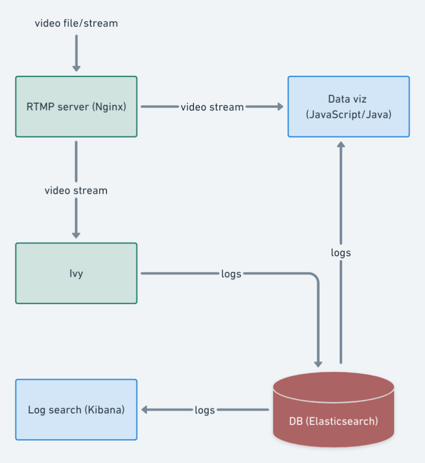
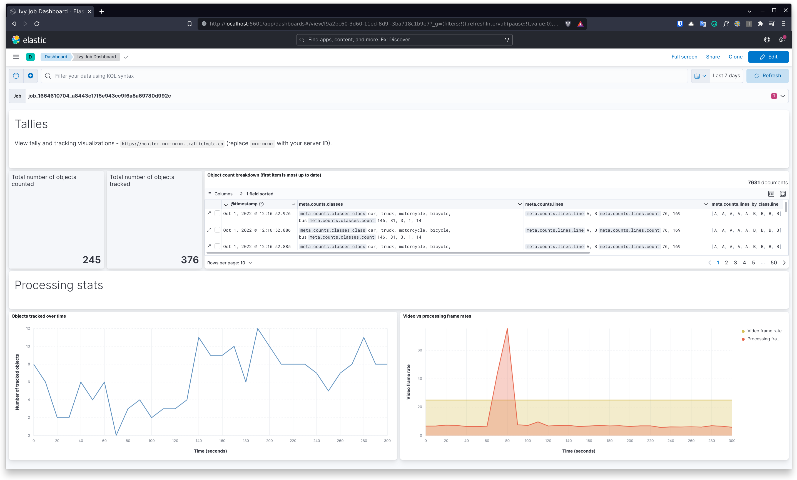
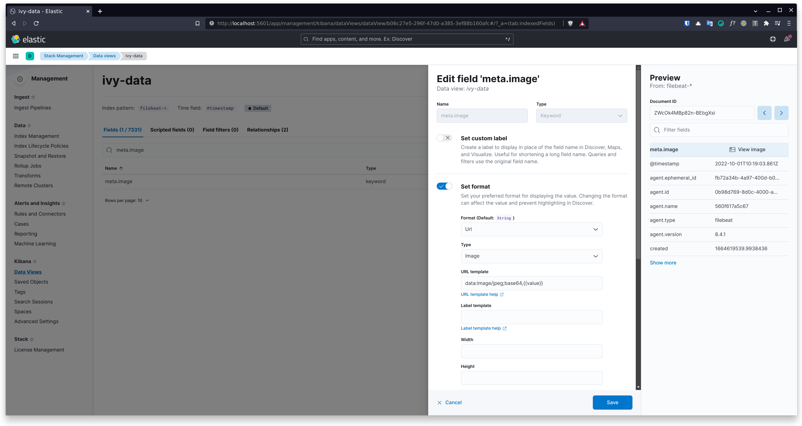
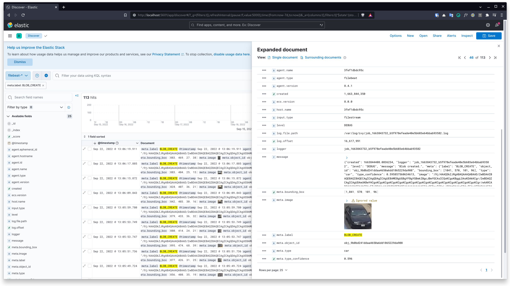

# Traffic Logic
Data pipeline for Ivy (video-based object counting software).

## Architecture

## Setup
- Clean up if need be: `sudo rm -r data/video-stream/*; sudo rm -r data/logs/*`.
- Build app server: `cd app-server && ./gradlew build && cd ..`.
- Build and run containers: `docker compose up --build`.
- Import Kibana dashboard (**ivy-dashboard-kibana.ndjson** file in project root). Go to `Stack Management > Saved Objects > Import`.
  
- (Optional) Display detected objects in Kibana. Go to `Stack Management > Data Views > ivy-data` and edit the `meta.image` field - Format: `Url`, Type: `Image`, URL Template: `data:image/jpeg;base64,{{value}}`.
  
  

## Demo
- Stream video to server with ffmpeg: `ffmpeg -re -i data/videos/demo.mp4 -c copy -f flv rtmp://localhost:1935/stream/ivy?secret_key=secret419`.
- Monitor video stream and tallies: http://localhost:6969.
- View logs: http://localhost:5601.
